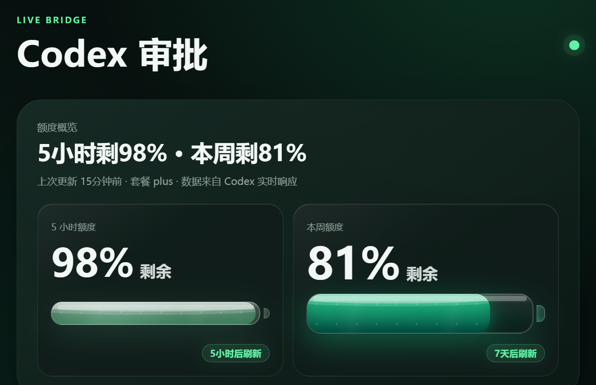
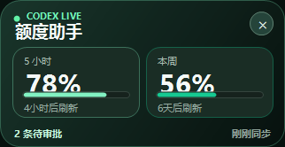
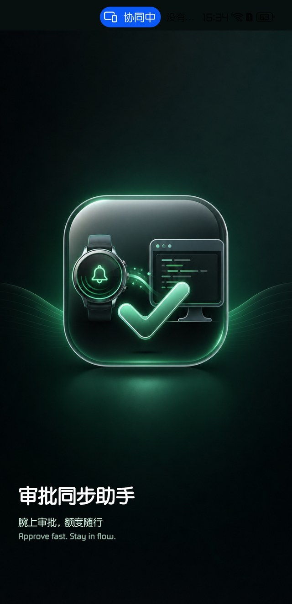
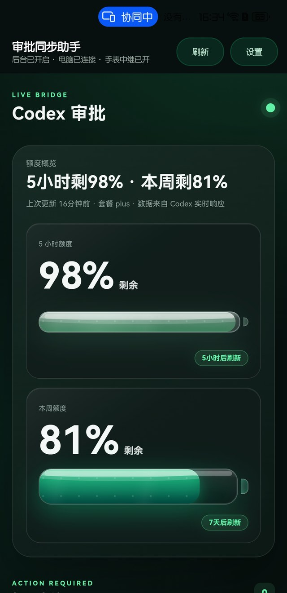
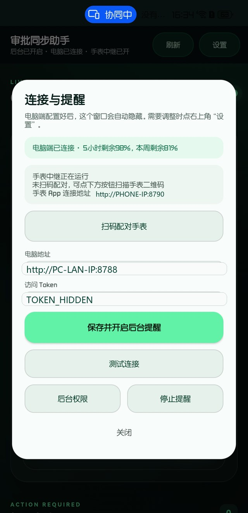
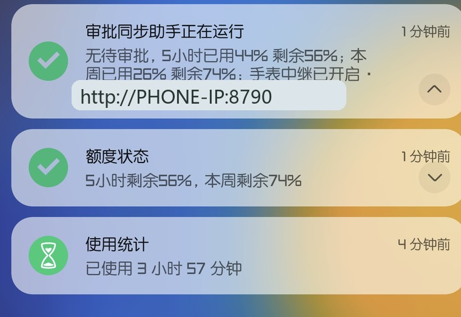
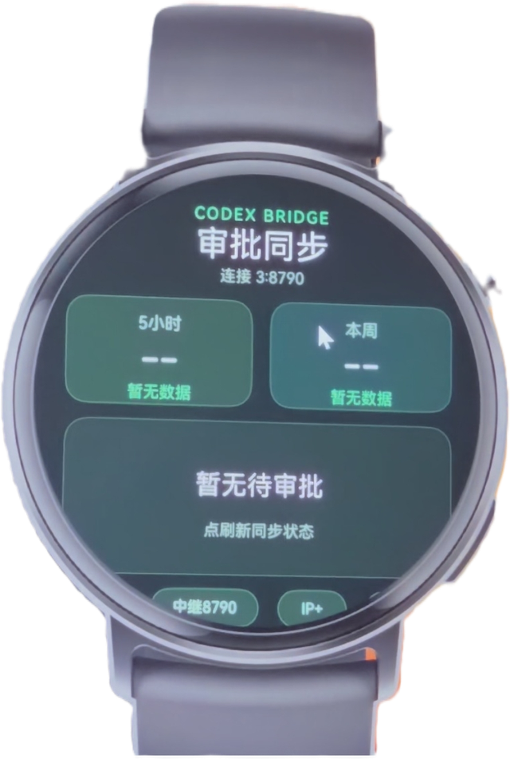
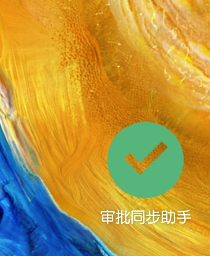

# 额度审批助手（局域网版，含 Windows 桌面额度小工具）

一款带有 Windows 桌面额度小工具的 Codex 权限审批与额度查看助手。它通过局域网把电脑、手机和智能穿戴设备连接起来；桌面小工具可在网页 Dashboard 中一键开启，持续显示 5 小时与本周剩余额度、刷新时间和待审批数量，不显示浏览器地址栏。

- `desktop-bridge/`：运行在电脑上的本地 Bridge 和网页 Dashboard。
- `android-app/`：运行在手机上的 Android App，支持审批、额度查看、后台提醒、手机到手表中继。
- `watch-wearable-app/`：DevEco Studio 智能穿戴 `wearable` 版手表 App，非 LiteWearable 版。
- `release/`：当前构建出的安装包和源码压缩包。

## 界面预览

以下截图已做公开发布处理，设置页中的 token 和局域网地址使用示例占位符。

<p align="center">
  
</p>

<p align="center">
  <br>
  <em>Windows 原生桌面额度小工具：可拖动、置顶显示、每 5 秒同步。</em>
</p>

<table>
  <tr>
    <td align="center"><br>手机启动页</td>
    <td align="center"><br>额度面板</td>
    <td align="center"><br>连接与提醒设置</td>
  </tr>
  <tr>
    <td align="center"><br>手机通知提醒</td>
    <td align="center"><br>手表端界面</td>
    <td align="center"><br>手机桌面图标</td>
  </tr>
</table>

## 当前版本状态

- 手机 APK：`release/phone-android-debug.apk`，公开配置版，默认 token 为 `CHANGE_ME`，安装后需要在 App 里填写自己的电脑地址和 token。
- 手表 HAP：`release/watch-wearable-unsigned.hap`，公开配置版，未签名。真机安装前需要在 DevEco Studio 中配置自己的调试签名并重新构建签名包。
- 电脑端：源码包 `release/desktop-bridge-source.zip`，也可以直接使用 `desktop-bridge/` 目录运行。Windows 版内含原生桌面额度小工具 `scripts/QuotaFloatingWindow.exe`。
- 桌面小工具：`release/windows-desktop-widget.exe`，由 Dashboard 在本机一键启停；源代码在 `desktop-bridge/scripts/QuotaFloatingWindow.cs`。

## 适用场景

电脑、手机、手表处在同一个局域网内：

```text
Codex Desktop
  -> desktop-bridge on PC
  -> Android phone app
  -> wearable watch app
```

手机负责连接电脑 Bridge，也可以作为手表访问电脑 Bridge 的中继。当前 `watch-wearable-app` 是智能穿戴 `wearable` 工程，不是 GT5 Pro 真机的 LiteWearable 工程。

## 快速开始

1. 在电脑上安装 Node.js 22.5 或更新版本。
2. 进入 `desktop-bridge/`，复制 `config.example.json` 为 `config.local.json`，按需填入通知配置。
3. 在 `desktop-bridge/` 运行：

```powershell
npm.cmd test
node --check src/server.mjs
.\start.ps1
```

4. 记下电脑端显示的 Dashboard 地址和 token。
5. 在电脑 Dashboard 右上角点击“悬浮窗”，开启“Windows 原生无边框悬浮窗”。可选择显示 5 小时额度、本周额度和紧凑布局；窗口可以直接拖动，点击右上角 `×` 关闭。
6. 手机上安装 `release/phone-android-debug.apk`。
7. 打开手机 App，填写电脑局域网地址，例如 `http://192.168.1.100:8788`，并填写电脑端 token。
8. 在手机 App 里打开后台提醒权限。
9. 如需手表端，打开 `watch-wearable-app/entry/src/main/ets/common/BridgeConfig.ets`，把地址和 token 改成手机中继地址或电脑 Bridge 地址，再用 DevEco Studio 配置签名并构建 HAP。

更完整步骤见 [docs/USER_MANUAL_zh-CN.md](docs/USER_MANUAL_zh-CN.md)。

## 安全说明

这个项目只适合局域网或可信网络使用。不要把 `desktop-bridge` 的端口直接暴露到公网。不要把自己的 `config.local.json`、token、签名证书、调试 profile 上传到 GitHub。

本仓库发布版已经把私人 token 和签名材料移除，示例配置需要用户自行填写。

## 验证记录

- 手机 APK 已重新构建并通过 `apksigner verify`。
- 手表 wearable HAP 已用 DevEco hvigor CLI 构建成功，当前为未签名包。
- 桌面 Bridge 源码已整理为独立目录，未包含本机运行数据。
